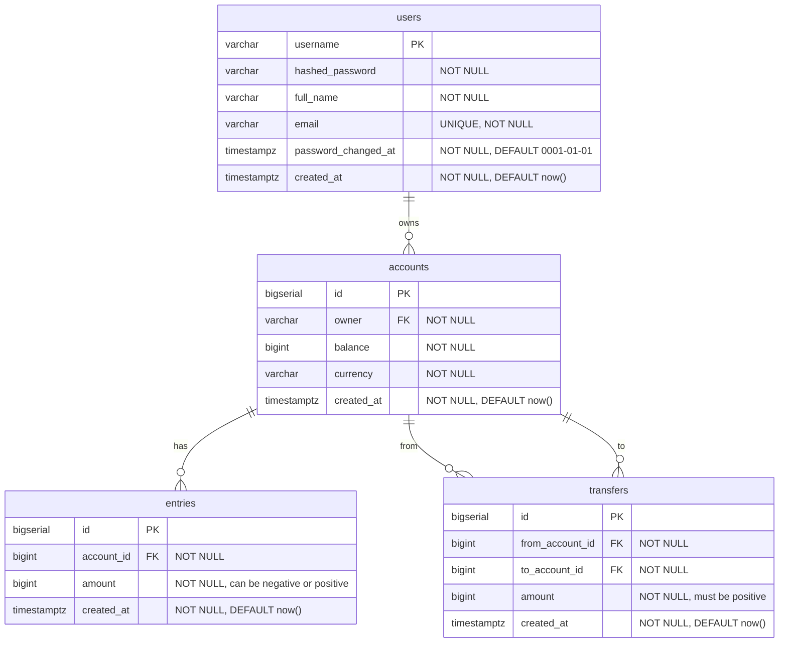

## Database Schema



**Summary of Entity Relationships**

- One user can own many accounts
- One account can have many entries
- One account can be the source of many transfers
- One account can be the destination of many transfers

## Docker Commands

List running containers:
```bash
docker ps
```

List all containers:
```bash
docker ps -a
```

List all available images:
```bash
docker images
```

Pull an image:
```bash
docker pull <image>:<tag>
```

Create and start a container:
```bash
docker run --name <container_name> -e <environment_variable> -d <image_name>:<tag>
```

Start a container:
```bash
docker start <container_name_or_id>
```

Stop a container:
```bash
docker stop <container_name_or_id>
```

Remove a container:
```bash
docker rm <container_name_or_id>
```

Port mapping:
```bash
docker run --name <container_name> -e <environment_variable> -p <host_ports:container_ports> -d <image>:<tag>
```

Run command in container:
```bash
docker exec -it <container_name_or_id> <command> [args]
```

Access container shell:
```bash
docker exec -it <container_name_or_id> /bin/sh
```

View container logs:
```bash
docker logs <container_name_or_id>
```

## Tools and References

- [DBDiagram](https://dbdiagram.io/)
- [Docker Desktop](https://www.docker.com/products/docker-desktop/)
- [Docker Postgres Image](https://hub.docker.com/_/postgres)
- [TablePlus](https://tableplus.com/)
- [Golang-Migrate](https://github.com/golang-migrate/migrate)
- [sqlc](https://sqlc.dev/)
- [Go Postgres Database Driver](https://github.com/lib/pq)
- [Testify](https://github.com/stretchr/testify)
- [GitHub Actions PostgreSQL Service Containers](https://docs.github.com/en/actions/using-containerized-services/creating-postgresql-service-containers)
- [Gin](https://github.com/gin-gonic/gin)
- [Viper](https://github.com/spf13/viper)
